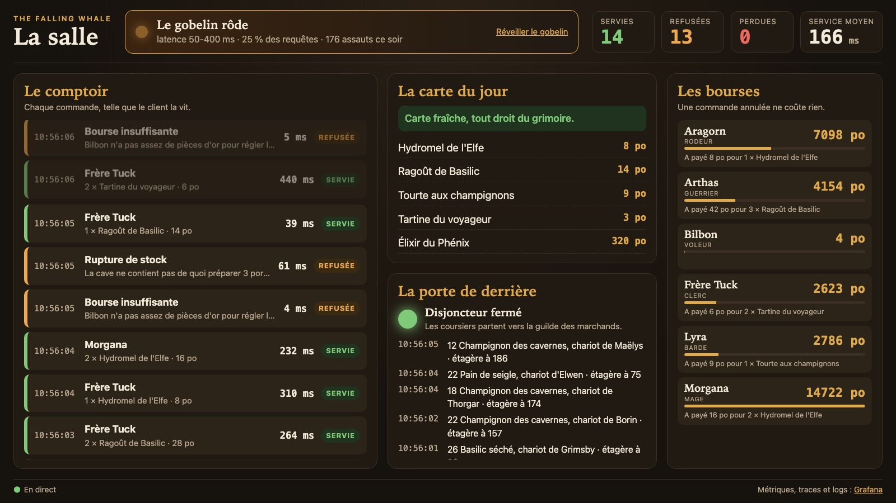
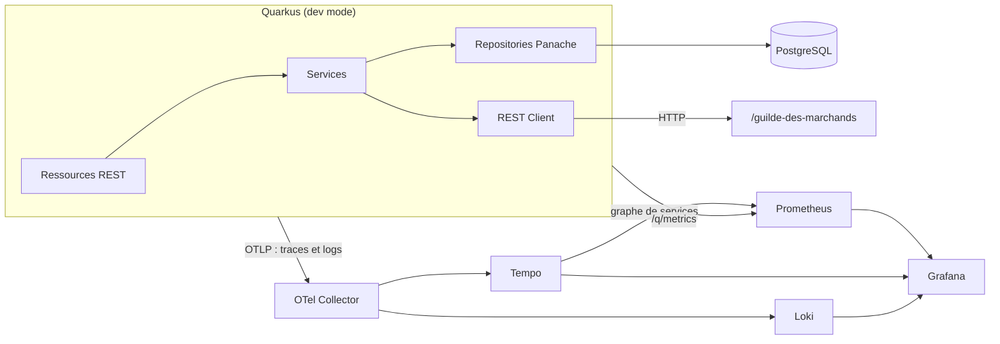
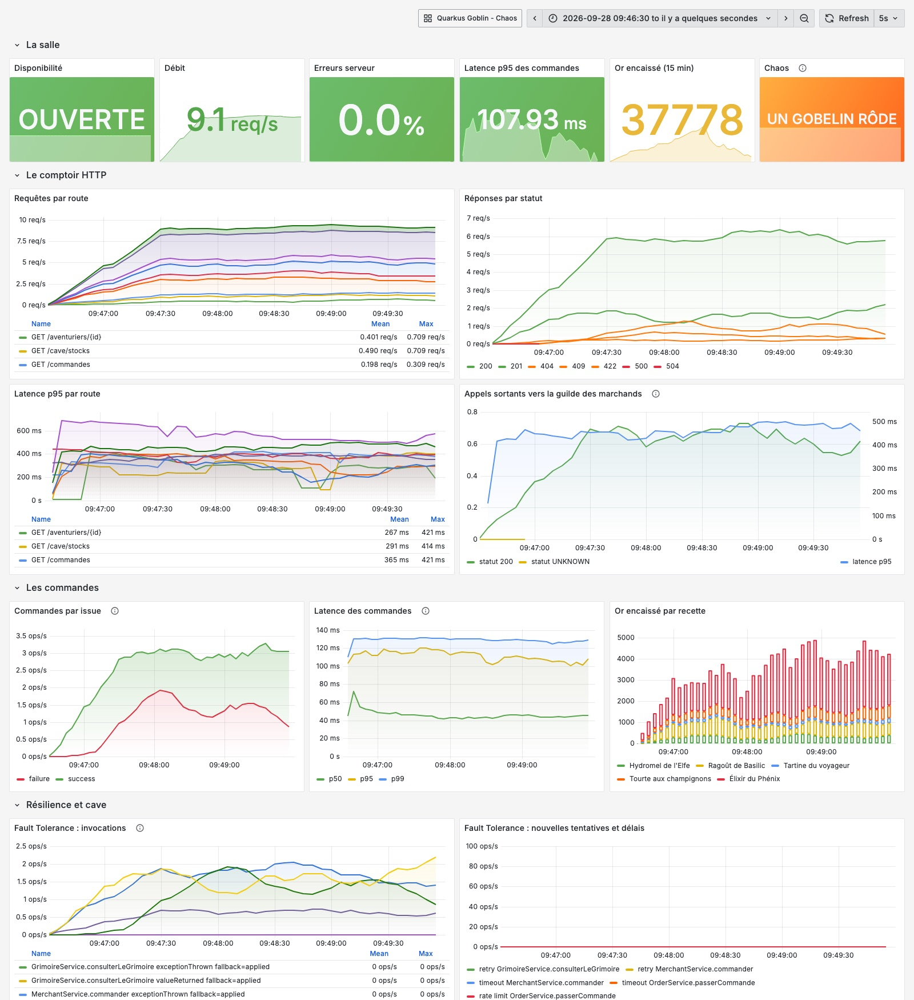
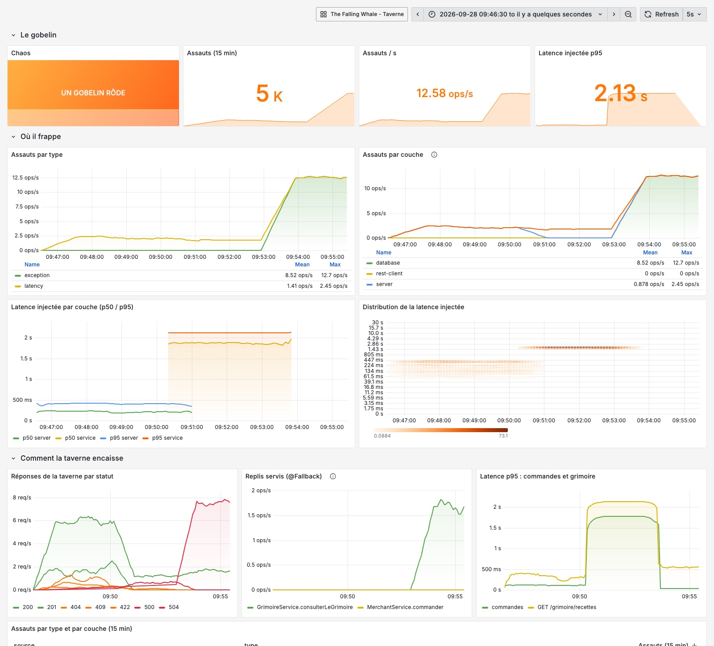
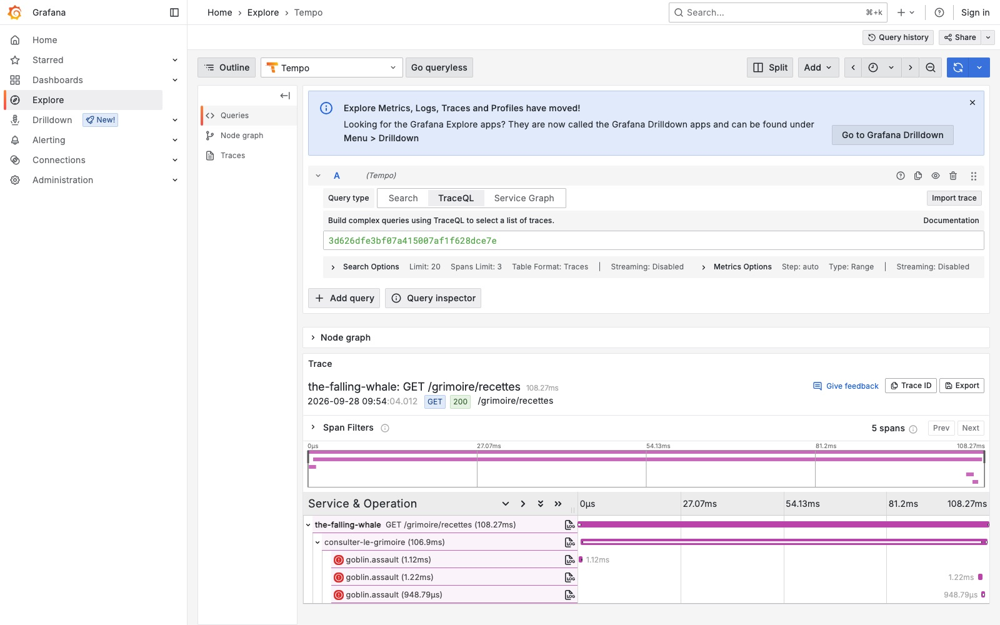
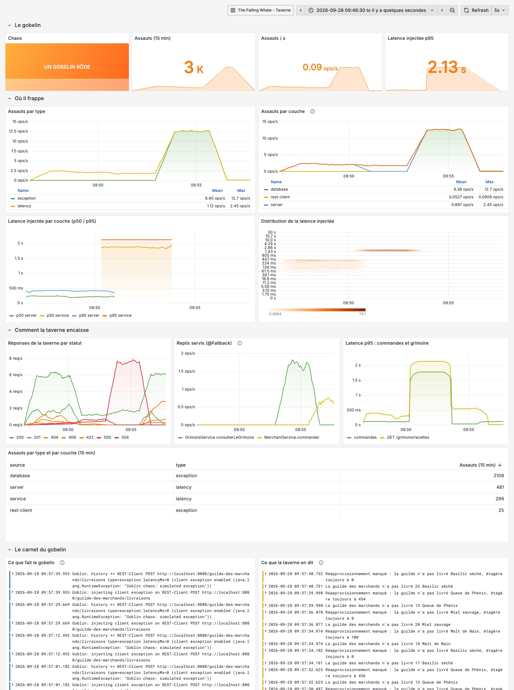
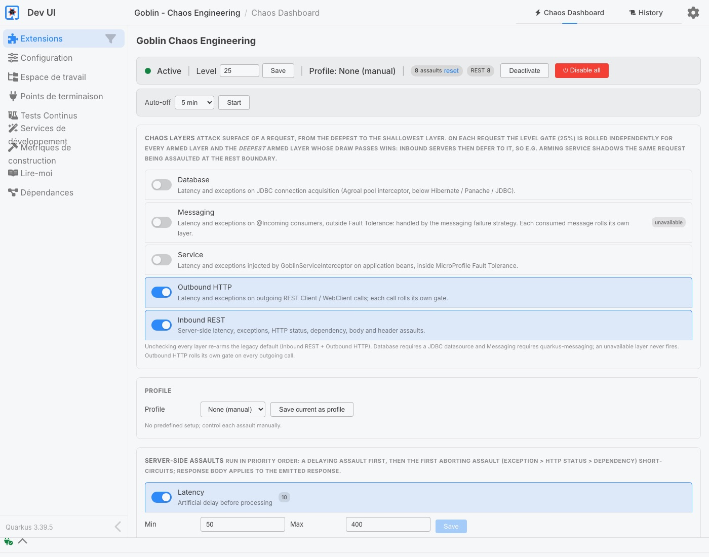
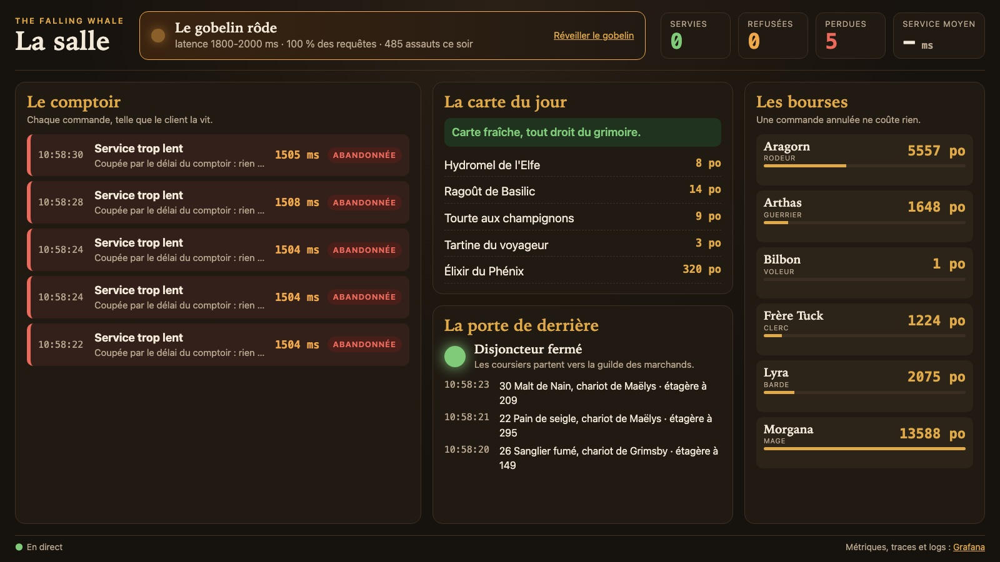
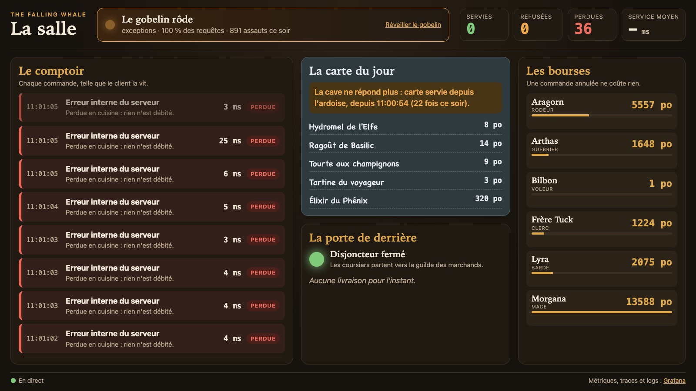
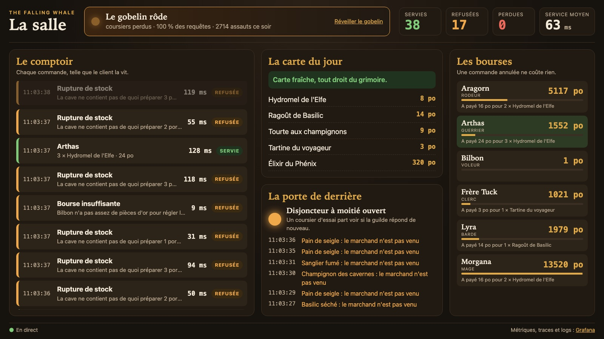

# The Falling Whale : Quarkus Goblin demo

> *Attention, un gobelin rôde dans la taverne.*

**The Falling Whale** est une taverne médiévale, et une application Quarkus complète :

- un grimoire de recettes ;
- une cave approvisionnée par la guilde des marchands ;
- un registre d'aventuriers ;
- un comptoir de commandes.

Elle sert de terrain de jeu à [Quarkus Goblin](https://github.com/quarkiverse/quarkus-goblin), l'extension de chaos
engineering pour Quarkus. On injecte des pannes depuis la Dev UI, on les voit arriver dans Grafana, et on vérifie
que `@Retry`, `@Fallback`, `@Timeout` et `@CircuitBreaker` tiennent vraiment.

L'application reprend les briques présentées dans la série d'articles *The Falling Whale* sur
[sfeir.dev](https://www.sfeir.dev/author/erwan/) (voir [Pour aller plus loin](#pour-aller-plus-loin)).



## Ce qu'il y a dans la taverne

| Brique | Détails |
|---|---|
| **API REST** | 5 ressources : `/grimoire`, `/cave`, `/aventuriers`, `/commandes`, `/guilde-des-marchands` |
| **Services** | `GrimoireService`, `CellarService`, `AdventurerService`, `OrderService`, `MerchantService`, `Kitchen` |
| **Persistance** | Hibernate ORM Panache, 5 repositories, PostgreSQL (H2 pour les tests) |
| **Appel sortant** | REST Client vers la guilde des marchands (servie par l'application elle-même, pour avoir un vrai appel HTTP sortant) |
| **Gestion des erreurs** | Centralisée, format RFC 9457 `application/problem+json`, voir [Les pièges du donjon](#les-pièges-du-donjon) |
| **Documentation** | OpenAPI + Swagger UI, avec toutes les réponses d'erreur documentées |
| **Résilience** | SmallRye Fault Tolerance : `@Retry`, `@Fallback`, `@Timeout`, `@CircuitBreaker`, `@RateLimit` |
| **Observabilité** | Micrometer / Prometheus, OpenTelemetry (traces HTTP, JDBC et métier, logs), logs corrélés aux traces, health checks |
| **Supervision** | Docker Compose : PostgreSQL, OpenTelemetry Collector, Tempo (traces), Loki (logs), Prometheus (métriques et règles d'alerte), Grafana (2 dashboards) |
| **Chaos** | Quarkus Goblin 0.3.0, avec ses modules métriques et traces |
| **La salle** | L'écran de démo : ce que vivent les clients, en direct (Qute et SSE) |



## Ouvrir la taverne

Prérequis : Java 25 et Docker (Docker Desktop sous macOS et Windows).

L'application tourne sur la machine, en **dev mode** : c'est le seul mode où Quarkus Goblin est actif, un build de
production ne contient aucune trace du gobelin. Le compose fournit la base de données et toute la stack
d'observabilité. **L'ordre compte** : l'application a besoin de PostgreSQL pour démarrer, et envoie ses traces et ses
logs au collecteur dès le premier instant.

### 1. Démarrer la stack Docker

```bash
docker compose up -d
```

Attendez que PostgreSQL soit prêt : la colonne `STATUS` doit afficher `healthy` pour `postgres`, et les six services
doivent être `running`.

```bash
docker compose ps
```

### 2. Démarrer l'application

Dans un autre terminal, à la racine du projet :

```bash
./mvnw quarkus:dev
```

Elle est prête quand la console affiche `Listening on: http://localhost:8080`. Au démarrage, elle crée le schéma et
remplit la cave (8 ingrédients, 5 recettes, 6 aventuriers). Si PostgreSQL n'est pas encore prêt, arrêtez-la
(`Ctrl`+`C`), attendez l'étape 1, et relancez-la.

### 3. Ouvrir la salle, la Dev UI et Grafana

| Quoi | Où |
|---|---|
| **La salle de la taverne** (l'écran de démo) | http://localhost:8080/salle |
| Grafana, dossier *The Falling Whale* | http://localhost:3000 (accès anonyme, sans connexion) |
| Dev UI (et le gobelin) | http://localhost:8080/q/dev-ui, carte **Goblin** |
| Swagger UI | http://localhost:8080/q/swagger-ui |
| Spécification OpenAPI | http://localhost:8080/openapi |
| Santé | http://localhost:8080/q/health |
| Métriques | http://localhost:8080/q/metrics |
| Prometheus et ses alertes | http://localhost:9090/alerts |
| Logs, dans Grafana | **Explore > Loki**, ou les panneaux *Le journal de la taverne* |
| Logs, dans un fichier | `target/logs/the-falling-whale.log` |

Prometheus met une quinzaine de secondes à voir l'application : les dashboards se remplissent ensuite.

### 4. Lancer du trafic

Pour animer les dashboards, lancez une soirée à la taverne (5 minutes, environ 5 requêtes par seconde) :

```bash
./scripts/trafic.sh
```

Vous pouvez alors [lâcher le gobelin](#le-gobelin-passe-à-lattaque).

### Fermer la taverne

Dans l'ordre inverse : `Ctrl`+`C` dans le terminal de `./mvnw quarkus:dev`, puis

```bash
docker compose down
```

La base, les traces, les logs et les métriques sont en mémoire : tout repart de zéro au prochain démarrage. La
configuration faite dans la Dev UI, elle, est conservée dans `.goblin-state.json` (voir plus bas).

### Quelques commandes au comptoir

```bash
# la carte du jour
curl -s localhost:8080/grimoire/recettes

# Arthas commande deux hydromels
curl -s -X POST localhost:8080/commandes -H 'Content-Type: application/json' \
  -d '{"adventurerId":1,"recipeId":1,"quantity":2}'

# Bilbon n'a que 25 pièces d'or : bourse insuffisante (422)
curl -s -X POST localhost:8080/commandes -H 'Content-Type: application/json' \
  -d '{"adventurerId":4,"recipeId":5,"quantity":1}'

# réapprovisionner le malt de nain auprès de la guilde des marchands
curl -s -X POST localhost:8080/cave/stocks/2/reapprovisionnement -H 'Content-Type: application/json' \
  -d '{"quantity":20}'
```

## Les pièges du donjon

Toutes les erreurs suivent le même format, quelle que soit leur origine :

- erreur métier ;
- validation ;
- Fault Tolerance ;
- route inconnue ;
- exception injectée par le gobelin.

```json
{
  "type": "urn:falling-whale:problem:bourse-insuffisante",
  "title": "Bourse insuffisante",
  "status": 422,
  "detail": "Bilbon n'a pas assez de pièces d'or pour régler la commande.",
  "instance": "http://localhost:8080/commandes",
  "timestamp": "2026-09-26T12:00:00.000Z",
  "code": "bourse-insuffisante",
  "prix": 320,
  "bourse": 25,
  "traceId": "4bf92f3577b34da6a3ce929d0e0e4736"
}
```

- `BusinessException` et le catalogue `TavernError` décrivent les pièges connus.
- `AbstractExceptionMapper` construit la réponse une seule fois pour tous les mappers.
- Il y a un mapper par famille d'erreur :
  - métier ;
  - validation ;
  - Fault Tolerance (`429`, `503`, `504`) ;
  - le filet de sécurité `GlobalExceptionMapper`.
- Le `traceId` de chaque erreur permet de retrouver sa trace complète dans Grafana (**Explore > Tempo**).

## La salle de la taverne

Des dashboards convainquent un public d'ops, mais en démo, le public doit **voir la taverne souffrir et tenir**. La
salle (http://localhost:8080/salle) montre ce que vivent les clients, en direct :

| Panneau | Ce qu'il montre |
|---|---|
| **Le gobelin** | s'il rôde, ce qu'il injecte, et sur quelle part des requêtes |
| **Les compteurs** | commandes servies, refusées (4xx) et perdues (5xx), temps de service moyen |
| **Le comptoir** | chaque commande avec son aventurier, sa recette et son temps : verte si servie, orange si refusée, rouge si abandonnée (`@Timeout`) ou perdue |
| **La carte du jour** | se transforme en ardoise à la craie quand le grimoire sert sa dernière carte connue (`@Fallback`) |
| **La porte de derrière** | la lanterne du disjoncteur de la guilde (verte fermé, rouge ouvert, orange à moitié) et les chariots qui arrivent, ou pas |
| **Les bourses** | l'or de chaque aventurier : il baisse à chaque commande servie, et ne bouge pas quand la commande est annulée |

Mise en scène conseillée : la salle en grand, la Dev UI Goblin à côté (lien *Réveiller le gobelin* dans la salle).
On clique dans la Dev UI, la salle réagit, et Grafana, Tempo et Loki n'arrivent qu'à la fin, pour expliquer *pourquoi*.

La salle observe l'application, elle ne simule rien : les services publient des événements du domaine (carte servie,
réapprovisionnement), un filtre JAX-RS regarde les commandes sortir du comptoir (y compris les `504`, qui ne sortent
jamais du service), et une ressource `/salle` les pousse en SSE. Elle est exclue du ciblage Goblin, des métriques HTTP
et des traces, pour que l'écran de démo reste lisible et ne fausse pas les dashboards.

La page elle-même ne lit jamais la base : la carte et les bourses sont chargées au démarrage, puis tenues à jour
par les commandes servies. Goblin 0.3.0 attaque aussi les appels faits depuis une requête exclue du ciblage : sans
ça, la salle tomberait en `500` pendant une panne de la cave.

## La tour de guet

- **Métriques métier** :
  - `@BusinessTimed("tavern.order")` produit `tavern_order_seconds` et `tavern_order_count_total`, avec un tag `outcome` ;
  - `tavern_gold_earned_total` compte l'or encaissé par recette.
- **Traces** : les requêtes HTTP, les requêtes JDBC, les spans métier (`@WithSpan`) et les spans `goblin.assault`
  pour chaque panne injectée.
- **Logs** :
  - les commandes servies, les réapprovisionnements, les refus métier et les erreurs, en français ; chaque assaut du
    gobelin en `DEBUG` ;
  - envoyés en OTLP au collecteur puis à **Loki**, où chaque ligne garde son `trace_id` : depuis une ligne, *Voir la
    trace* ouvre la trace dans Tempo, et depuis une trace, *Logs for this span* ouvre ses logs ;
  - en dev mode, une copie (niveau `INFO` et plus) dans `target/logs/the-falling-whale.log`, quel que soit le terminal
    qui a lancé l'application ;
  - dans la console, chaque ligne porte aussi `traceId` et `spanId`.
- **Dashboards Grafana**, dans le dossier *The Falling Whale* :
  - *The Falling Whale - Taverne* : disponibilité, débit, erreurs, latences par route, commandes, or encaissé,
    Fault Tolerance, connexions JDBC ;
  - *Quarkus Goblin - Chaos* : assauts par type et par couche, latence injectée, et la façon dont la taverne encaisse
    (statuts HTTP, replis servis) ;
  - en bas de chacun, les logs Loki : volume par niveau, avertissements et erreurs, journal complet, et le *carnet du
    gobelin* avec chaque panne injectée.
- **Alertes Prometheus** :
  - `TavernApiDown` ;
  - `TavernOrderLatencyP95High` ;
  - `TavernErrorRateHigh` ;
  - `GoblinChaosActive`.









## Le gobelin passe à l'attaque

Au démarrage, le gobelin ajoute déjà 50 à 400 ms de latence sur 25 % des requêtes REST entrantes (voir
`application.properties`). Tout le reste se pilote dans la **Dev UI > Goblin > Chaos Dashboard**.



Lancez `./scripts/trafic.sh` dans un terminal, gardez les deux dashboards Grafana ouverts, puis essayez :

| # | Dans la Dev UI | Ce qui se passe | Où le voir (la salle, puis Grafana) |
|---|---|---|---|
| 1 | Couche **Inbound REST**, **Latency** `600`-`900` ms, niveau `100` | Tout ralentit ; l'alerte `TavernOrderLatencyP95High` passe en *firing* au bout d'une minute | Latences par route, http://localhost:9090/alerts |
| 2 | Couche **Service** seule, **Latency** `1800`-`2000` ms | Les commandes dépassent le `@Timeout(1500)` de `OrderService` : `504`, et la transaction est annulée (la bourse n'est pas débitée) | Le comptoir se remplit de commandes *abandonnées* à 1,5 s, les bourses ne bougent plus ; statuts `504`, *Fault Tolerance : nouvelles tentatives et délais* |
| 3 | Couche **Database** seule, **Exception** | La cave tombe : `GET /grimoire/recettes` réessaie deux fois (`@Retry`), puis sert l'*ardoise*, la dernière carte connue (`@Fallback`), toujours en `200` ; les commandes, elles, échouent en `500` | La carte passe à l'ardoise, le comptoir se remplit de commandes *perdues* ; *Replis servis*, assauts `database` |
| 4 | Couche **Outbound HTTP** seule, **client exception** | La guilde des marchands ne répond plus : deux nouvelles tentatives, puis `MARCHAND_ABSENT` ; après quelques échecs, le `@CircuitBreaker` s'ouvre et n'envoie plus de coursier pendant 10 s : le repli est alors immédiat (`@Retry(abortOn = CircuitBreakerOpenException.class)`) | La lanterne de la porte de derrière passe au rouge, les chariots n'arrivent plus ; assauts `rest-client`, *Disjoncteur de la guilde des marchands* |
| 5 | Couche **Inbound REST**, **HTTP Status** `503` à `30` % | Des `503` aléatoires, la courbe d'erreurs monte, `TavernErrorRateHigh` se déclenche | *Réponses par statut* |
| 6 | **Auto-off** 5 min, puis fermez la Dev UI | Le gobelin s'arrête tout seul à l'échéance | Stat *Chaos* |

Ce que la salle en montre :

**Scénario 2, la cuisine traîne** : les commandes sont abandonnées à 1,5 s, les bourses ne bougent pas.



**Scénario 3, la cave tombe** : la carte est servie depuis l'ardoise, les commandes sont perdues.



**Scénario 4, le marchand ne vient plus** : le disjoncteur s'ouvre, les livraisons manquent, et les ruptures de
stock finissent par arriver au comptoir.



`Disable all`, ou `Ctrl`/`Cmd` + `Shift` + `X` dans le Chaos Dashboard, coupe tout immédiatement.

> Pourquoi les scénarios 2 et 3 frappent la couche **Service** ou **Database**, et pas **Inbound REST** ? À la
> frontière REST, la panne arrive avant que la méthode protégée par `@Timeout` ou `@Retry` ne s'exécute : les
> annotations ne la voient jamais. Voir la documentation de Goblin sur les
> [couches de chaos](https://docs.quarkiverse.io/quarkus-goblin/dev/how-it-works.html#chaos-layers).

La configuration faite dans la Dev UI est enregistrée dans `.goblin-state.json` (ignoré par git). Supprimez ce
fichier pour repartir de `application.properties`.

## Les tests

```bash
./mvnw test
```

Les tests tournent sur H2, sans Docker :

- `GrimoireResourceTest`, `OrderResourceTest`, `CellarResourceTest` : l'API et le format des erreurs ;
- `ObservabilityTest` : santé, métriques métier, OpenAPI ;
- `ChaosResilienceTest` : le gobelin attaque les tests (`quarkus.goblin.test.enabled=true` dans un `@TestProfile`),
  et on vérifie les scénarios 2, 3 et 4 ci-dessus : l'ardoise, le `504`, le marchand absent, et le disjoncteur ouvert qui
  répond sans attendre les nouvelles tentatives.

Dans les autres tests, le gobelin reste inactif : c'est le comportement par défaut de Quarkus Goblin en test.

## Pour aller plus loin

- [Quarkus Goblin](https://github.com/quarkiverse/quarkus-goblin) et sa
  [documentation](https://docs.quarkiverse.io/quarkus-goblin/dev/)
- [La Taverne Panache : persister les recettes avec Quarkus](https://www.sfeir.dev/back/la-taverne-panache-persister-les-recettes-avec-quarkus/)
- [Cartographier les pièges d'un donjon : industrialiser la gestion des erreurs avec Quarkus](https://www.sfeir.dev/back/cartographier-les-pieges-dun-donjon-industrialiser-la-gestion-des-erreurs-avec-quarkus/)
- [Mettre en place la documentation OpenAPI dans une application Quarkus](https://www.sfeir.dev/back/mettre-en-place-la-documentation-openapi-dans-une-application-quarkus/)
- [La taverne sous contrôle : maîtriser les flux avec Quarkus](https://www.sfeir.dev/back/la-taverne-sous-controle-maitriser-les-flux-avec-quarkus/)
- [Observer la taverne en pleine effervescence : observabilité avec Quarkus](https://www.sfeir.dev/back/observer-la-taverne-en-pleine-effervescence-observabilite-avec-quarkus/)
- [Quand la taverne monte en charge : Prometheus, Grafana et alerting avec Quarkus](https://www.sfeir.dev/back/quand-la-taverne-monte-en-charge-prometheus-grafana-et-alerting-avec-quarkus/)
